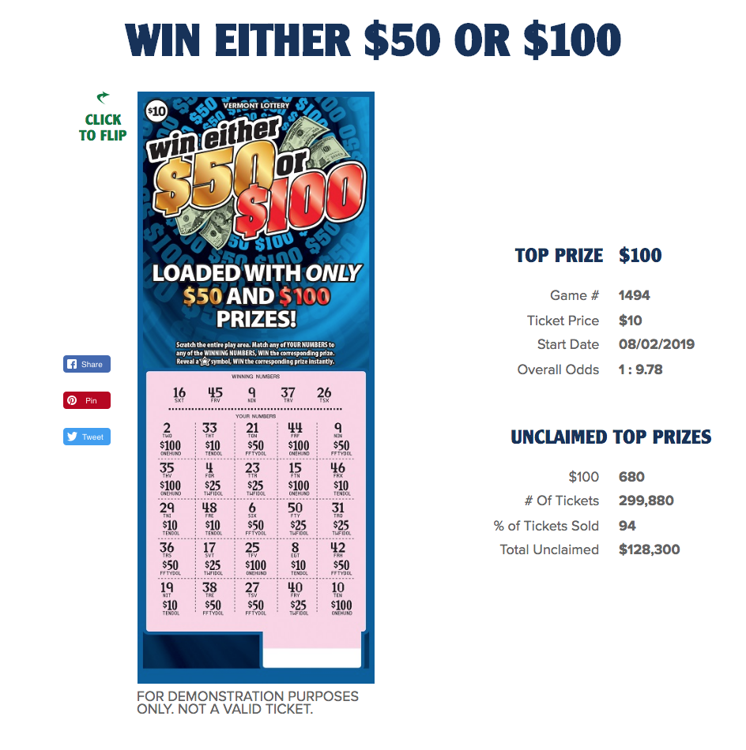

```{r setup, include=FALSE}
knitr::opts_chunk$set(
	echo = FALSE,
	message = FALSE,
	warnings = FALSE
)
library(data.table)
library(tidyverse)
library(ggthemes)
library(quantreg)
```

## Motivation

```{r}

```


## Our Questions:

- Is a given game worth playing?
- If not, how likely is it that it will become worth playing?

## Instant Tickets

- Games are played once
- Each game never resets
- Randomness is limited to location of tickets

## An Example:

```{r}

```

## Our intuition is correct at the outset

```{r}
library(kableExtra)
# options(knitr.table.format = "latex")
probLoss <- 1- sum(c(1/7, 1/38, 1/33, 1/81, 1/5250, 1/11667, 1/60000))

values <- c(c("Value", 0, 7, 15, 25, 70, 700, 1000, 7777, "Probability"), round(c(probLoss, 1/7, 1/38, 1/33, 1/81, 1/5250, 1/11667, 1/60000), 5))
pmfX <- matrix(values, 
               ncol = 2)
knitr::kable(pmfX) %>%
  kable_styling(c("striped", "bordered"))
```

Expected Value = `r c(0, 7, 15, 25, 70, 700, 1000, 7777) %*% c(probLoss, 1/7, 1/38, 1/33, 1/81, 1/5250, 1/11667, 1/60000)` < 5.

## This game is *sometimes* worth playing!

```{r pressure}

### read in sapphire 7s data first
sapphire7s <- fread("/Users/michael/Desktop/Side Projects/VT Lottery/SDDSimulationData.csv") %>%
  sample_frac(0.01)

nTickets <- 612000 ### Need to change

sapphire7s %>%
  ggplot(aes(x = tickets, y = Value)) +
  geom_point() +
  labs(x = "Tickets sold in 100s",
       y = "Expected Value",
       title = "Expected Value over Time") +
  theme_classic() +
  geom_hline(yintercept = 5, color = "red")
```

## Let's take a closer look:

```{r}

### zoom in to last 10% of tickets
sapphire7s %>%
  filter(tickets > nTickets*.9/100) %>%
  ggplot(aes(x = tickets, y = Value)) +
  geom_point() +
  labs(x = "Tickets sold in 100s",
       y = "Expected Value",
       title = "Expected Value over Time") +
  theme_classic() #+
  # geom_hline(yintercept = 5, color = "red")
```

## Then make use of the information available to us:

```{r}
sapphire7s %>%
  filter(tickets > nTickets*.9/100) %>%
  ggplot(aes(x = tickets, y = Value, color = factor(thousands))) +
  geom_point() +
  labs(x = "Tickets sold in 100s",
       y = "Expected Value",
       title = "Expected Value over Time") +
  theme_classic() +
  scale_color_colorblind() +
  labs(x = "Tickets sold in 100s",
       y = "Expected Value",
       title = "Expected Value over Time",
       color = "Grand Prizes Remaining")


```

## We have the necessary information to estimate the value of a ticket

```{r}
sapphire7s %>%
  filter(tickets > nTickets*.95/100) %>%
  group_by(tickets, factor(thousands)) %>%
  summarize(lower_bound = quantile(Value, 0.1)) %>%
  ggplot(aes(x = tickets, y = lower_bound, color = `factor(thousands)`)) +
  geom_line() +
  scale_color_colorblind() +
  theme_classic() +
  labs(x = "Tickets sold in 100s",
       y = "Expected Value",
       title = "Expected Value over Time",
       color = "Grand Prizes Remaining")
```

## Another game:

```{r}

```


## It's all in the name:

```{r}
library(kableExtra)
# options(knitr.table.format = "latex")
probLoss <- 1- sum(c(1/16, 1/26))

values <- c(c("Value", 0, 50, 100, "Probability"), round(c(probLoss, 1/16, 1/26), 5))
pmfX <- matrix(values, 
               ncol = 2)
knitr::kable(pmfX) %>%
  kable_styling(c("striped", "bordered"))
```

Expected Value = `r c(0, 50, 100) %*% c(probLoss, 1/16, 1/26)` < 10.

## This game is also sometimes worth playing!

```{r}
win50Data <-  fread("/Users/michael/Desktop/Side Projects/VT Lottery/SDDSimulationData.csv") %>%
  sample_frac(0.01)

win50Data %>%
  ggplot(aes(x = tickets, y = Value)) +
  geom_point() +
  theme_classic() +
  labs(x = "Tickets sold in 100s",
       y = "Expected Value",
       title = "Expected Value over Time") +
  geom_hline(yintercept = 10)
```


## But tracking grand prizes isn't helpful

```{r}
win50Data %>%
  ggplot(aes(x = tickets, y = Value, color = thousands)) +
  geom_point() +
  theme_classic() +
  labs(x = "Tickets sold in 100s",
       y = "Expected Value",
       title = "Expected Value over Time",
       color = "Grand Prizes Remaining")
```
<!-- Rinse and repeat with win 50 for the first graph and then color -->
<!-- talk about the perecentage of times each enters the state -->
<!-- show that they enter at different times -->